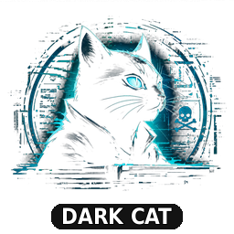

<p align="center">
  
</p>

# Darkcat

**Maintainer:** Overdrive (Borja Tarraso) &lt;borja.tarraso@member.fsf.org&gt;
**License:** GPL-3.0-or-later
**Source:** <https://github.com/borjatarraso/darkcat>

A crawler for darknets and obscure overlay networks. It classifies every
URL by protocol, routes it through the right transport, crawls BFS from
seed lists with topic-keyword scoring, and stores everything in SQLite
(FTS5). Ships in four flavours over the same engine:

- **CLI** — `darkcat …` (one-shot subcommands)
- **Shell / REPL** — `darkcat shell` (interactive line editor)
- **TUI** — `darkcat tui` (Textual full-screen terminal app)
- **GUI** — `darkcat gui` (Tkinter desktop window)

Run `darkcat --about` for a one-line summary, `darkcat -h` for the full
reference, or `darkcat -la` to discover curated entry points across every
supported protocol.

> Use this for security research, journalism, OSINT, accessing
> censorship-resistant content, or interop testing. You are responsible
> for what you fetch and where you point it. Don't use it to break laws.

## Supported protocols

| Family | URL form | Transport / requirement |
| --- | --- | --- |
| **Tor** onion services | `*.onion` (v2 16ch / v3 56ch) | Local Tor SOCKS5, default `127.0.0.1:9050` |
| **I2P** eepsites | `*.i2p`, `*.b32.i2p` | Local I2P HTTP proxy, default `127.0.0.1:4444` |
| **IPFS / IPNS** | `ipfs://CID`, `ipns://name`, `*/ipfs/CID` | Local IPFS gateway `127.0.0.1:8080` (Kubo), optional public fallback |
| **Hyphanet / Freenet** | `freenet:CHK@…`, `USK@…`, `SSK@…`, `KSK@…` | Local FProxy `127.0.0.1:8888` |
| **Lokinet (Oxen)** | `*.loki` | System routing — the lokinet TUN |
| **GNUnet / GNS** | `*.gnu`, `*.zkey` | System GNS resolver |
| **ZeroNet** | `zero://<address>` | Local ZeroNet UI `127.0.0.1:43110` |
| **Gemini** (small web) | `gemini://host[:1965]/path` | Native TLS+TOFU client (no daemon needed) |
| **Gopher** | `gopher://host[:70]/<sel>` | Native socket client (no daemon needed) |
| **Hyper / Hypercore** | `hyper://<key>/path` | `hyper.fyi` gateway (best-effort; ideally local Beaker / hyperdrive node) |
| **Yggdrasil** mesh | IPv6 in `200::/7` | System TUN (yggdrasil daemon) |
| **cjdns / Hyperboria** | IPv6 in `fc00::/8` | System TUN (cjdroute) |
| **Namecoin** | `*.bit` | `ncdns` running, or OpenNIC DNS that mirrors `.bit` |
| **ENS** | `*.eth` | `eth.limo` gateway fallback (or local ENS resolver) |
| **Handshake (HNS)** | `*.hns`, `.c`, `.p`, `.forever`, `.welcome`, `.decentralized` | `hsd`/`hnsd` running, else `hns.is` gateway |
| **OpenNIC** peering TLDs | `.geek` `.free` `.indy` `.pirate` `.libre` `.neo` `.bbs` `.o` `.oss` `.oz` `.parody` `.dyn` `.epic` `.fur` `.null` `.chan` `.micro` | OpenNIC DNS server in `/etc/resolv.conf` |
| **Clearnet** (any other URL) | `https://…` | Tunneled through Tor when Tor is up; direct otherwise |

`darkcat status` reports which transports are reachable on this machine.

## Install

```sh
cd darkcat
python -m venv .venv
. .venv/bin/activate
pip install -e .
```

Or, without installing — use the bundled launcher (auto-detects `.venv/`,
falls back to system `python3`):

```sh
pip install -r requirements.txt
./darkcat status
```

### Desktop integration (Linux)

A FreeDesktop entry and hicolor icons live under `share/`. Install them
into your prefix to get a "Darkcat" launcher in the application menu and
correct icons in the GUI's title bar / taskbar:

```sh
install -Dm644 share/applications/darkcat.desktop \
    ~/.local/share/applications/darkcat.desktop
for s in 64 128 256 512 1024; do
  install -Dm644 "share/icons/hicolor/${s}x${s}/apps/darkcat.png" \
      "$HOME/.local/share/icons/hicolor/${s}x${s}/apps/darkcat.png"
done
update-desktop-database ~/.local/share/applications 2>/dev/null || true
```

System-wide packagers can drop the same trees under `/usr/share/`.

### Shell completion (bash / zsh / fish)

Darkcat soft-imports [`argcomplete`](https://kislyuk.github.io/argcomplete/)
to power tab-completion of subcommands and flags. Install it (it's a
no-op for runtime if you never enable completion):

```sh
pip install -e '.[completion]'
```

Then, for the current shell:

```sh
# bash
eval "$(register-python-argcomplete darkcat)"

# zsh
autoload -U bashcompinit && bashcompinit
eval "$(register-python-argcomplete darkcat)"

# fish
register-python-argcomplete --shell fish darkcat | source
```

Add the line to your shell's rc file to make it permanent.

## Daemons (Linux examples)

```sh
# Tor
sudo dnf install tor          # or: apt install tor
sudo systemctl start tor

# I2P (i2pd — lightweight C++ router)
sudo dnf install i2pd
sudo systemctl start i2pd

# IPFS (Kubo)
# https://docs.ipfs.tech/install/
ipfs init && ipfs daemon &

# OpenNIC DNS (also resolves .bit, .geek, .free, …)
# Pick from https://servers.opennic.org and add to /etc/resolv.conf

# Hyphanet (Freenet) — Java installer at https://www.hyphanet.org
# Lokinet — https://lokinet.org
# Yggdrasil — https://yggdrasil-network.github.io
# cjdns — https://github.com/cjdelisle/cjdns
# Handshake (hsd or hnsd) — https://hsd-dev.org / https://github.com/handshake-org/hnsd
# ZeroNet — https://github.com/ZeroNetX/ZeroNet (largely abandoned)
```

Gemini and Gopher need no daemon — Darkcat speaks them natively over a socket.

## Usage

`darkcat -h` shows a clean help screen with the full protocol table, every
subcommand, and example invocations. Highlights:

```sh
darkcat status                       # which daemons are reachable
darkcat seeds all                    # built-in seed list

# Fetch one URL through the right transport.
darkcat fetch gemini://geminiprotocol.net/ --show
darkcat fetch http://duckduckgogg42xjoc72x3sjasowoarfbgcmvfimaftt6twagswzczad.onion/ --show
darkcat fetch ipns://docs.ipfs.tech --show

# Crawl Tor seeds for whistleblower content, 200 pages, 3 hops deep.
darkcat crawl \
    --protocol tor \
    --topics whistleblower leak securedrop \
    --max-pages 200 --max-depth 3 \
    --threshold 0.5

# Crawl Gemini space (no daemon required).
darkcat crawl --protocol gemini --topics privacy --max-depth 3

# Stay inside one network — don't follow cross-protocol links.
darkcat crawl --protocol i2p --no-cross-protocol --max-pages 50

# Custom seeds.
darkcat crawl --seed-file my_seeds.txt --topics journalism censorship

# Query the local DB.
darkcat search "secure drop"
darkcat top --limit 30 --protocol tor
darkcat stats
```

## Leak / credential scan

Pattern-based detection of credential dumps, API keys, private keys,
credit cards, BIP-39 seed phrases, SQL dumps, and breach-marker keywords
in already-crawled pages. Findings store a salted SHA-256 of each secret
plus a redacted preview — never the raw secret.

```sh
# Scan everything we've crawled, restricted to onion services,
# only flag mentions of your domain.
darkcat scan --target example.com --protocol tor

# One-shot scan of a live paste / leak-mirror URL (doesn't store body).
darkcat scan --url http://pastedata2…onion/leaks/2026-04

# Restrict to specific categories, salt the digests so they're not
# comparable to anyone else's database.
darkcat scan --category email_password github_token --salt my-secret

# Browse / filter the findings table.
darkcat findings --category email_password -n 100
darkcat findings --target example.com
```

Categories: `email_password`, `aws_access_key`, `aws_secret_key`,
`github_token`, `slack_token`, `stripe_key`, `google_api_key`,
`discord_token`, `jwt`, `private_key`, `pgp_block`, `credit_card`,
`sql_dump`, `seed_phrase`, `breach_marker`.

The intent is detection — surfacing where leaks appear so defenders /
threat-intel teams can monitor and respond. Storage is hashed + redacted
by design; the digest column lets you correlate against IOC feeds without
re-identifying anyone.

### Watchlist + alerting

Register patterns; when a *new* finding matches, the configured sink fires
and an `alerts` row is recorded.

```sh
darkcat watch add --target example.com --sink notify --note "my domain"
darkcat watch add --category github_token --sink webhook:https://hooks.example/x
darkcat watch add --target '\.gov$' --regex --sink file:/var/log/darkcat-alerts.jsonl
darkcat watch list
darkcat watch test 1                # synthesize a finding through sink #1
darkcat alerts -n 50
```

Sinks: `log` (stdout) · `notify` (libnotify desktop notification via
`notify-send`) · `file:PATH` (append one JSON object per alert) ·
`webhook:URL` (HTTP POST a JSON payload).

### Diff / change watch

`record_page` snapshots `(url, content_hash, title, text, captured_at)`
into a `page_history` table on every fetch where the text has changed. Use
this to surface ransomware-leak-site updates, market re-listings, etc.

```sh
# URLs whose snapshots changed in the last 24h.
darkcat diff --since 24h --protocol tor

# Unified diff between the two newest snapshots for one URL.
darkcat diff --url onion://victims-list…/

# Inspect the snapshot timeline.
darkcat history --url onion://victims-list…/
```

### IOC export (JSONL / STIX 2.1 / MISP)

Emit findings as a hash-based IOC feed for SOC/TIP integration. Only the
SHA-256 digest goes out — never the underlying secret.

```sh
darkcat export --format jsonl > findings.jsonl
darkcat export --format stix --since 7d -o week.stix.json
darkcat export --format misp --category email_password -o leaks.misp.json
```

## Coverage uplift

### Form-based discovery (`discover`)

Submit a topic query to a stack of darknet search engines (Ahmia, Haystak,
Torch, Phobos, OnionLand, Submarine), parse their result pages, unwrap
redirector links, and emit one URL per line on stdout — ready to pipe into
a crawl.

```sh
darkcat discover --list-engines
darkcat discover whistleblower > seeds.txt
darkcat crawl --seed-file seeds.txt -t whistleblower leak securedrop -n 200
```

`--engines ahmia ahmia-onion` restricts which engines are queried;
`--max-per-engine N` caps results.

### Sitemap / feed probing (`feeds`)

Probes a host's well-known paths (`sitemap.xml`, `feed`, `rss.xml`,
`atom.xml`, `feed.json`, `.well-known/host-meta`, …) and emits the URLs
referenced therein. Cheap coverage uplift on Gemini and any reasonably
well-behaved clearnet site.

```sh
darkcat feeds https://blog.example.org/
```

### Encoded-link extraction

The crawler now runs a second pass over each fetched page that recovers
URLs hidden in:

- inline JavaScript / data attributes (literal strings)
- base64 chunks that decode to URL-bearing text
- ROT13'd hostnames or URLs (`uggc://...`, `.bavba`)

A standalone command surfaces the same set for inspection / debugging:

```sh
darkcat decode-links http://obfusc-mirror…onion/
darkcat decode-links URL --diff   # only URLs the normal parser missed
```

### Image OCR (`ocr`)

Fetch a page, find every ``, run each image through Tesseract, and
print the recognized text. Onion sites image-encode text to dodge
crawlers; this re-feeds it into the topic filter and the leak scanner.

```sh
sudo dnf install tesseract     # Fedora
sudo apt install tesseract-ocr # Debian/Ubuntu

darkcat ocr http://image-encoded-leak…onion/posts/2026
darkcat ocr URL --lang eng+rus
```

### Mirror / clone clustering (`clusters`)

Groups crawled URLs by identical latest text content. Surfaces the 30
`.onion` mirrors of the same site as a single cluster — invaluable for
triage on dark.fail-style entry points.

```sh
darkcat clusters             # min cluster size 2
darkcat clusters --min 5     # only clusters with 5+ mirrors
```

### HIBP-style hash-prefix server

Localhost-only HTTP service over the `findings` table. Lets other tooling
ask "do you know this hash?" without ever exposing plaintext.

```sh
darkcat serve --bind 127.0.0.1:7531

# In another shell:
curl http://127.0.0.1:7531/range/df62a
# → <suffix>:<count>:<category>:<protocol>
curl http://127.0.0.1:7531/digest/<full-64-hex>
# → <category>:<protocol>:<count>  (or 404)
curl http://127.0.0.1:7531/healthz
```

## TUI

```sh
darkcat tui
```

Opens a Textual app:

- A status bar with green/red dots for every protocol's reachability.
- A form for topics, protocol selector, max-pages/depth/threshold.
- Live RichLog of every fetched/skipped/errored URL during a crawl.
- Sortable results table backed by the SQLite store.
- An FTS5 search box and a single-URL fetch box.

Key bindings: `q` quit · `Ctrl+R` refresh status · `Ctrl+C` stop crawl ·
`F5` refresh results table.

## Shell (REPL)

```sh
darkcat shell
```

A `cmd.Cmd` loop with readline editing and history. Same commands as the
CLI, no need to re-launch between calls:

```
darkcat> status
darkcat> fetch gemini://geminiprotocol.net/ --show
darkcat> crawl -p gemini -t privacy -n 30 -d 2
darkcat> search "secure drop"
darkcat> top -p tor -n 20
darkcat> quit
```

`help` lists every command, `help <cmd>` shows its usage. Ctrl-D also exits.

## GUI

```sh
darkcat gui
```

Tkinter desktop window with the same affordances as the TUI: status bar,
crawl form, live log pane, sortable results table, search box, single-URL
fetch box. Tk is part of the Python stdlib but on some Linux distros lives
in a separate package — install `python3-tk` (Debian/Ubuntu) or
`python3-tkinter` (Fedora) if importing Tk fails.

## Operational hygiene

### Tor stream isolation

Each Tor fetch uses a unique `(user, password)` on the SOCKS handshake
derived from the URL's host. With Tor's default `IsolateSOCKSAuth` flag,
this puts every host on its own circuit — same host shares a circuit,
different hosts don't get correlated. Default ON; turn off with
`--no-tor-isolation` or set `cfg.tor_stream_isolation = False`.

### Tor control: NEWNYM, info, bridges

Talk to the Tor control port (default 9051). Auth is auto-discovered via
`PROTOCOLINFO` (NULL / cookie / password). No `stem` dependency — pure
stdlib socket talk.

```sh
darkcat tor newnym                       # request new identity (rate-limited)
darkcat tor info                         # version, uptime, circuit status
darkcat tor bridges                      # list configured bridges
darkcat tor bridges-add "obfs4 1.2.3.4:443 FINGERPRINT cert=... iat-mode=0"
darkcat tor bridges-clear
```

If your tor uses cookie auth in a non-standard location, pass
`--tor-control-cookie /path/to/cookie`. For password auth, pass
`--tor-control-password 'secret'`. Bridge / pluggable-transport
*configuration* still lives in torrc (`UseBridges 1` and
`ClientTransportPlugin obfs4 …`); these commands flip the bridge *list*
at runtime without restarting tor.

### Abuse blocklist

Hard-skip URLs / hosts / hashes you never want to crawl (CSAM, dox
archives, private personal data). Rules live in a plain text file:

```
# host (exact)
host:bad.example.onion
# host suffix
.abuse.onion
# URL substring
urlcontains:/dox/
# SHA-256 of decoded page text
hash:b966dff91b92b293…
```

Use it on a crawl, then audit afterwards:

```sh
darkcat crawl --blocklist /etc/darkcat/blocklist.txt …
darkcat blocklist test --file /etc/darkcat/blocklist.txt http://x.onion/...
darkcat blocklist log -n 50
```

URLs matched by host/url rules are skipped before fetching; hash rules
are checked after fetching but before storing, so the page body never
hits the SQLite DB. Every block is recorded in `blocklist_audit` with
the rule that triggered it.

### Active probes for system-routed protocols

`darkcat status` now runs cheap, root-free probes for protocols that
were previously assumed reachable:

- **Yggdrasil** — local interface holds an address in `200::/7`.
- **cjdns** — local interface holds an address in `fc00::/8`.
- **Lokinet** — there is a `lokitun*` (or `lokinet*`) interface in
  `/sys/class/net/`.

On non-Linux systems where `/proc/net/if_inet6` and `/sys/class/net`
aren't available, the probes return True (preserving the prior behavior
of trusting the user).

## Protocol-specific commands

### Telegram channels (`telegram`)

`t.me/s/<channel>` serves rendered HTML of recent messages — no API key,
no `tdlib`. Each message has a permalink, ISO datetime, body text, and
inline links. With `--ingest`, every message becomes a synthetic page
(protocol=`telegram`) so the leak scanner sees it like any other crawl
target.

```sh
darkcat telegram example_channel --limit 50 --pages 3
darkcat telegram leak_channel --ingest        # then `darkcat scan`
```

### PGP key harvest (`keys`)

Many vendor pages publish a PGP block. `keys harvest` scans the crawled
pages table, extracts every `BEGIN PGP PUBLIC KEY BLOCK`, and (if `gpg`
is on PATH) resolves fingerprint + user IDs.

```sh
darkcat keys harvest                    # scan all crawled pages
darkcat keys list                       # browse harvested keys
darkcat keys list --fpr DEADBEEF        # substring on fingerprint
darkcat keys show <fingerprint>         # print the full armored block
```

### I2P jump-service auto-resolve

When an I2P fetch fails because the host isn't in the local addressbook,
`I2PTransport` retries via `notbob.i2p` → `stats.i2p` jump pages,
extracts the resulting `*.b32.i2p` address, and re-fetches. Configurable
via `cfg.i2p_jump_services`.

### Local Hyper / hypercore gateway

`HyperTransport` now prefers a local `127.0.0.1:4501` gateway (Beaker /
hypercored) when it's listening, falling back to the public `hyper.fyi`
gateway otherwise. Override via `cfg.hyper_local_gateway`.

### ZeroNet content.json walk (`zeronet-walk`)

ZeroNet sites publish a JSON manifest at `<site>/content.json`. This
walks the file graph (recursing into `includes`) and fetches every file
through the local ZeroNet UI. With `--ingest`, every file is stored as a
page so `scan` / `findings` see it.

```sh
darkcat zeronet-walk 1HelloAddress… --limit 200
darkcat zeronet-walk 1HelloAddress… --ingest
```

### Tor circuits + descriptor query

```sh
darkcat tor circuits                # list current circuits via control port
darkcat tor descriptor <onion>      # dump a v3 onion's descriptor (from cache)
```

Useful for verifying stream isolation (different hosts → different
circuit IDs) and for inspecting what tor knows about a particular hidden
service. Both go through the existing `--tor-control-port` /
`--tor-control-cookie` / `--tor-control-password` plumbing.

## How crawling works

1. Seed URLs are normalized and classified by protocol
   (`darkcat/protocols.py`). The classifier recognizes URL schemes
   (`gemini://`, `ipfs://`, `freenet:`, …), TLDs (`*.onion`, `*.i2p`,
   `*.eth`, `*.bit`, OpenNIC TLDs, …), and IPv6 ranges (Yggdrasil's
   `200::/7`, cjdns's `fc00::/8`).
2. Each URL is dispatched to its transport (`darkcat/transports.py`):
   - HTTP-based (Tor SOCKS5h, I2P HTTP proxy, IPFS/Freenet/ZeroNet
     gateways) is built on `requests`.
   - **Gemini** uses a native TLS+TOFU socket client on port 1965.
   - **Gopher** uses a native socket client on port 70 with menu parsing.
   - System-routed transports (Lokinet, GNUnet, Yggdrasil, cjdns,
     Namecoin, OpenNIC, Handshake) just `requests.get` and rely on the
     daemon's TUN/DNS.
   - **ENS / Handshake / Hyper** fall back to public gateways
     (`eth.limo`, `hns.is`, `hyper.fyi`) when no local resolver works.
3. Pages are parsed (`darkcat/extractor.py`): HTML → BeautifulSoup;
   Gemini → gemtext (`=> URL [label]`); Gopher → menu lines
   (`<type>display\tselector\thost\tport`).
4. Topic scorer (`darkcat/topic_filter.py`) gives each page a score:
   `(body_hits + 5×title_hits + phrase_hits) / log(body_tokens + 10)`.
5. BFS frontier expands links, gated by max-depth, max-pages, per-host cap,
   score threshold, and cross-protocol/clearnet rules
   (`darkcat/crawler.py`).
6. Results land in SQLite + FTS5 (`darkcat/storage.py`).

## Privacy notes

- Tor SOCKS uses `socks5h://` so DNS is resolved by the exit / hidden
  service, not your machine.
- User-agent mimics Tor Browser by default to reduce fingerprinting.
- Clearnet links found inside darknet pages are tunneled through Tor too
  whenever Tor is reachable.
- Gemini's TOFU model means we don't validate against the public CA store
  (matches reference clients). Cert pinning isn't implemented yet.
- `--public-ipfs` is off by default because public gateways leak the
  request to a third party.
- `--follow-clearnet` is off by default — you opt in to leaving the darknet.
- ENS / Handshake gateway fallbacks (`eth.limo`, `hns.is`) similarly leak
  the request; a local resolver avoids that.

## Layout

```
darkcat              shell launcher (no install required)
src/darkcat/
  cli.py            argparse entry point with rich --help
  tui.py            Textual UI (status bar, crawl form, log, results table)
  repl.py           interactive `cmd.Cmd` shell wrapping the CLI commands
  gui.py            Tkinter desktop GUI (mirrors the TUI in a window)
  config.py         defaults, ports, paths, gateway hosts
  protocols.py      URL → Protocol classifier (18 protocols)
  transports.py     per-protocol fetchers
  fetcher.py        protocol → transport dispatch
  extractor.py      HTML / Gemini / Gopher → title/text/links
  topic_filter.py   keyword + phrase scoring
  crawler.py        BFS crawler with stop-event and event callbacks
  scanner.py        regex/Luhn-based credential / leak detector
  watch.py          watchlist matching + sink dispatch (log/notify/file/webhook)
  export.py         findings → JSONL / STIX 2.1 / MISP serializers
  server.py         HIBP-style hash-prefix HTTP server
  discovery.py      submit topic queries to onion search engines, harvest seeds
  feeds.py          sitemap / RSS / Atom / JSON-Feed probing
  encoded.py        rescue URLs from JS strings / base64 / ROT13
  ocr.py            Tesseract integration for image-encoded pages
  torctl.py         minimal Tor control-port client (NEWNYM, bridges, info)
  probe.py          active reachability probes for Yggdrasil / cjdns / Lokinet
  blocklist.py      abuse blocklist (host / suffix / urlcontains / hash rules)
  telegram.py       t.me/s/<channel> scraper (no auth)
  pgp.py            PGP public-key block extractor (gpg --show-keys helper)
  zeronet.py        content.json walker for ZeroNet sites
  storage.py        SQLite + FTS5 (pages, links, full-text, findings,
                                    page_history, watchlist, alerts)
  seeds.py          default seed lists per protocol
```

## Documentation

The `docs/` directory carries the long-form material:

- **`docs/QUICKSTART.md`** — start-from-zero tutorial: install, first
  crawl, first persona, first chat login.
- **`docs/USERGUIDE.md`** — surface vs deep vs dark vs darknet, plus a
  per-network field manual and opsec hygiene notes.
- **`docs/NETWORKS.md`** — purpose / strengths / weaknesses for every
  overlay, distributed-web, small-web, and messaging network darkcat
  speaks (or recognizes).
- **`docs/INTERNALS.md`** — architecture, fetch path, scan path,
  watchlist firing model, schema, threat model, extension points.
- **`docs/CONFIG.md`** — every `Config` field, env var, and CLI flag.
- **`docs/identity/`** — Identity Generator (compartmented account creation
  for 15 providers; manual-assist signup; encrypted vault; CLI/REPL/TUI/GUI
  parity). Start at `docs/identity/01-overview.md`.

Run `darkcat init` once for a guided first-run bootstrap.

## Limitations

- Onion / I2P / IPFS / Freenet addresses churn fast. Built-in seeds use
  long-lived clearnet directories (tor.taxi, dark.fail, ahmia, notbob.i2p,
  …) so you discover current addresses rather than stale ones.
- No JavaScript execution — sites that need JS will look empty.
- Hyper:// rarely works without a local hyperdrive node; the gateway is
  best-effort.
- For Lokinet, GNUnet, Yggdrasil, and cjdns we can't probe daemon state
  without root, so `status` shows them as reachable and a fetch failure
  is reported as `unavailable: <reason>`.
